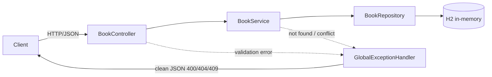

<!-- ══════════════════════════ TITLE ══════════════════════════ -->
<div align="center">
  
</div>

<br/>

<!-- ══════════════════════ IDIOMAS / LANGUAGES ══════════════════════ -->
<div align="center">
<a href="README.md"></a>
<a href="README.en.md"></a>
<a href="README.es.md"></a>
</div>

<br/>

[](https://github.com/geoggrigori/library-api/actions/workflows/ci.yml)

# library-api


A clean, well-tested Spring Boot REST API for managing a small library of books. It demonstrates a classic layered architecture (controller, service, repository), JPA persistence on an in-memory H2 database, Bean Validation with a centralized error handler, and a borrow/return workflow with conflict detection.

## Features

- Full CRUD for books (`title`, `author`, `isbn`, `available`).
- Optional `?available=true|false` filter when listing books.
- Optional case-insensitive `?title=` and `?author=` substring search, combinable with `?available=`.
- Borrow and return workflow, returning `409 Conflict` when a book is already borrowed.
- Bean Validation (`@NotBlank`, `@Pattern` for the ISBN) with clean `400` JSON responses.
- Consistent JSON error payloads for `400`, `404`, and `409` via a `@RestControllerAdvice`.
- In-memory H2 database with the H2 web console enabled.
- Comprehensive integration tests with MockMvc.

## Architecture



## Endpoints

| Method | Path                  | Description                                  | Status codes              |
|--------|-----------------------|----------------------------------------------|---------------------------|
| GET    | `/books`              | List books (optional `?title=`, `?author=`, `?available=` filters) | `200`                     |
| GET    | `/books/{id}`         | Get a book by id                             | `200`, `404`              |
| POST   | `/books`              | Create a book                                | `201` (+ `Location`), `400` |
| PUT    | `/books/{id}`         | Update an existing book                      | `200`, `400`, `404`       |
| DELETE | `/books/{id}`         | Delete a book                                | `204`, `404`              |
| POST   | `/books/{id}/borrow`  | Borrow a book (sets `available=false`)       | `200`, `404`, `409`       |
| POST   | `/books/{id}/return`  | Return a book (sets `available=true`)        | `200`, `404`              |

## Getting started

Requirements: JDK 21. No local Maven install is needed — the Maven Wrapper is included.

```bash
./mvnw spring-boot:run
```

The API starts on `http://localhost:8080`.

### H2 console

The H2 web console is available at `http://localhost:8080/h2-console`.
Use JDBC URL `jdbc:h2:mem:librarydb`, user `sa`, and an empty password.

## API examples

Create a book (returns `201` with a `Location` header):

```bash
curl -i -X POST http://localhost:8080/books \
  -H "Content-Type: application/json" \
  -d '{"title":"Clean Code","author":"Robert C. Martin","isbn":"9780132350884"}'
```

Validation failure (returns `400` with field errors):

```bash
curl -i -X POST http://localhost:8080/books \
  -H "Content-Type: application/json" \
  -d '{"title":"","author":"","isbn":"abc"}'
```

```json
{
  "status": 400,
  "error": "Bad Request",
  "message": "Validation failed",
  "fieldErrors": {
    "title": "title is required",
    "author": "author is required",
    "isbn": "isbn must contain 10 to 17 digits or dashes"
  }
}
```

List books, only the available ones:

```bash
curl http://localhost:8080/books?available=true
```

Search by title and/or author (case-insensitive substring), combinable with `available`:

```bash
curl "http://localhost:8080/books?title=clean&author=martin&available=true"
```

Get a single book:

```bash
curl http://localhost:8080/books/1
```

Update a book:

```bash
curl -X PUT http://localhost:8080/books/1 \
  -H "Content-Type: application/json" \
  -d '{"title":"Clean Code","author":"Robert C. Martin","isbn":"978-0132350884"}'
```

Borrow a book:

```bash
curl -X POST http://localhost:8080/books/1/borrow
```

Borrowing an already-borrowed book returns `409`:

```json
{
  "status": 409,
  "error": "Conflict",
  "message": "Book with id 1 is already borrowed"
}
```

Return a book:

```bash
curl -X POST http://localhost:8080/books/1/return
```

Delete a book (returns `204`):

```bash
curl -i -X DELETE http://localhost:8080/books/1
```

## Running tests

```bash
./mvnw test
```

The suite uses JUnit 5 and Spring Boot Test with MockMvc, covering CRUD, validation errors, missing-resource handling, the `available`, `title`, and `author` search filters, and the borrow/return flow including the conflict case.

## License

Released under the [MIT License](LICENSE). Copyright (c) 2026 Geovana Grigorio.
