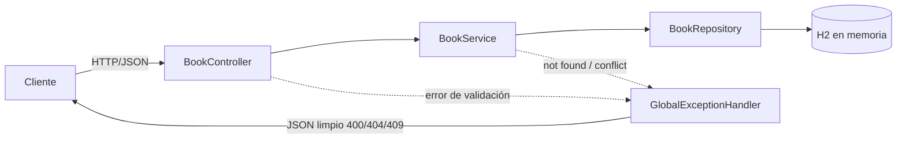

<!-- ══════════════════════════ PORTADA ══════════════════════════ -->
<div align="center">
  
</div>

<!-- ══════════════════════ IDIOMAS / LANGUAGES ══════════════════════ -->
<div align="center">
<a href="README.md"></a>
<a href="README.en.md"></a>
<a href="README.es.md"></a>
</div>

<h1 align="center">library-api</h1>
<p align="center"><em>API REST Spring Boot para gestionar una pequeña biblioteca de libros</em></p>
<p align="center"><strong>Controller → Service → Repository (JPA) → H2, con flujo de préstamo/devolución</strong></p>

<div align="center">
<a href="https://github.com/geoggrigori/library-api/actions/workflows/ci.yml"></a>


</div>

<div align="center">
<a href="#acerca-de"></a>
<a href="#arquitectura"></a>
<a href="#endpoints"></a>
<a href="#uso"></a>
</div>

<br/>

> ☕ **No necesita Maven local** — el Maven Wrapper ya viene incluido. `./mvnw spring-boot:run` y listo.

## Acerca de

API REST Spring Boot limpia y bien probada para gestionar una pequeña biblioteca de libros. Demuestra una arquitectura en capas clásica (controller, service, repository), persistencia JPA en base H2 en memoria, Bean Validation con manejo de errores centralizado, y un flujo de préstamo/devolución con detección de conflictos.

**Destacados:**
- CRUD completo para libros (`title`, `author`, `isbn`, `available`).
- Filtro opcional `?available=true|false` y búsqueda por `?title=`/`?author=` (substring, case-insensitive).
- Flujo de préstamo y devolución, devolviendo `409 Conflict` cuando el libro ya está prestado.
- Bean Validation con respuestas JSON `400` limpias.
- Payloads de error JSON consistentes para `400`, `404` y `409` vía `@RestControllerAdvice`.
- Consola web de H2 habilitada.
- Pruebas de integración exhaustivas con MockMvc.

## Arquitectura



## Endpoints

| Método | Ruta | Descripción | Status |
|---|---|---|---|
| GET | `/books` | Lista libros (filtros `?title=`, `?author=`, `?available=`) | `200` |
| GET | `/books/{id}` | Busca un libro por id | `200`, `404` |
| POST | `/books` | Crea un libro | `201` (+ `Location`), `400` |
| PUT | `/books/{id}` | Actualiza un libro existente | `200`, `400`, `404` |
| DELETE | `/books/{id}` | Elimina un libro | `204`, `404` |
| POST | `/books/{id}/borrow` | Presta un libro (`available=false`) | `200`, `404`, `409` |
| POST | `/books/{id}/return` | Devuelve un libro (`available=true`) | `200`, `404` |

## Uso

Requisito: JDK 21. No necesitas Maven instalado — el wrapper ya viene incluido.

```bash
./mvnw spring-boot:run
```

API en `http://localhost:8080`. Consola H2 en `http://localhost:8080/h2-console` (JDBC `jdbc:h2:mem:librarydb`, usuario `sa`, contraseña vacía).

**Ejemplos:**
```bash
# Crear un libro (devuelve 201 + Location)
curl -i -X POST http://localhost:8080/books \
  -H "Content-Type: application/json" \
  -d '{"title":"Clean Code","author":"Robert C. Martin","isbn":"9780132350884"}'

# Prestar
curl -X POST http://localhost:8080/books/1/borrow

# Buscar por título/autor (combinable con available)
curl "http://localhost:8080/books?title=clean&author=martin&available=true"
```

**Pruebas:**
```bash
./mvnw test
```
JUnit 5 + Spring Boot Test con MockMvc, cubriendo CRUD, errores de validación, recursos ausentes, filtros de búsqueda, y el flujo de préstamo/devolución incluyendo el caso de conflicto.

## Licencia

[MIT](LICENSE).

<div align="center">
  
</div>

<p align="center"><sub>Desarrollado por <strong><a href="https://github.com/geoggrigori">Grigori</a></strong> · 2026</sub></p>
