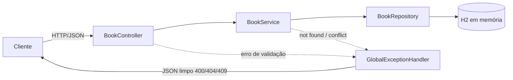

<!-- ══════════════════════════ TÍTULO ══════════════════════════ -->
<div align="center">
  
</div>

<!-- ══════════════════════ IDIOMAS / LANGUAGES ══════════════════════ -->
<div align="center">
<a href="README.md"></a>
<a href="README.en.md"></a>
<a href="README.es.md"></a>
</div>

<h1 align="center">library-api</h1>
<p align="center"><em>API REST Spring Boot para gerenciar uma pequena biblioteca de livros</em></p>
<p align="center"><strong>Controller → Service → Repository (JPA) → H2, com fluxo de empréstimo/devolução</strong></p>

<div align="center">
<a href="https://github.com/geoggrigori/library-api/actions/workflows/ci.yml"></a>


</div>

<div align="center">
<a href="#sobre"></a>
<a href="#arquitetura"></a>
<a href="#endpoints"></a>
<a href="#uso"></a>
</div>

<br/>

> ☕ **Sem Maven local necessário** — o Maven Wrapper já vem incluso. `./mvnw spring-boot:run` e pronto.

## Sobre

API REST Spring Boot limpa e bem testada para gerenciar uma pequena biblioteca de livros. Demonstra uma arquitetura em camadas clássica (controller, service, repository), persistência JPA em banco H2 em memória, Bean Validation com tratamento de erro centralizado, e um fluxo de empréstimo/devolução com detecção de conflito.

**Destaques:**
- CRUD completo para livros (`title`, `author`, `isbn`, `available`).
- Filtro opcional `?available=true|false` e busca por `?title=`/`?author=` (substring, case-insensitive).
- Fluxo de empréstimo e devolução, retornando `409 Conflict` quando o livro já está emprestado.
- Bean Validation com respostas JSON `400` limpas.
- Payloads de erro JSON consistentes pra `400`, `404` e `409` via `@RestControllerAdvice`.
- Console web do H2 habilitado.
- Testes de integração abrangentes com MockMvc.

## Arquitetura



## Endpoints

| Método | Rota | Descrição | Status |
|---|---|---|---|
| GET | `/books` | Lista livros (filtros `?title=`, `?author=`, `?available=`) | `200` |
| GET | `/books/{id}` | Busca um livro por id | `200`, `404` |
| POST | `/books` | Cria um livro | `201` (+ `Location`), `400` |
| PUT | `/books/{id}` | Atualiza um livro existente | `200`, `400`, `404` |
| DELETE | `/books/{id}` | Remove um livro | `204`, `404` |
| POST | `/books/{id}/borrow` | Empresta um livro (`available=false`) | `200`, `404`, `409` |
| POST | `/books/{id}/return` | Devolve um livro (`available=true`) | `200`, `404` |

## Uso

Requisito: JDK 21. Não precisa de Maven instalado — o wrapper já vem incluso.

```bash
./mvnw spring-boot:run
```

API em `http://localhost:8080`. Console H2 em `http://localhost:8080/h2-console` (JDBC `jdbc:h2:mem:librarydb`, user `sa`, senha vazia).

**Exemplos:**
```bash
# Criar um livro (retorna 201 + Location)
curl -i -X POST http://localhost:8080/books \
  -H "Content-Type: application/json" \
  -d '{"title":"Clean Code","author":"Robert C. Martin","isbn":"9780132350884"}'

# Emprestar
curl -X POST http://localhost:8080/books/1/borrow

# Buscar por título/autor (combinável com available)
curl "http://localhost:8080/books?title=clean&author=martin&available=true"
```

**Testes:**
```bash
./mvnw test
```
JUnit 5 + Spring Boot Test com MockMvc, cobrindo CRUD, erros de validação, recursos ausentes, filtros de busca, e o fluxo de empréstimo/devolução incluindo o caso de conflito.

## Licença

[MIT](LICENSE).

<div align="center">
  
</div>

<p align="center"><sub>Desenvolvido por <strong><a href="https://github.com/geoggrigori">Grigori</a></strong> · 2026</sub></p>
